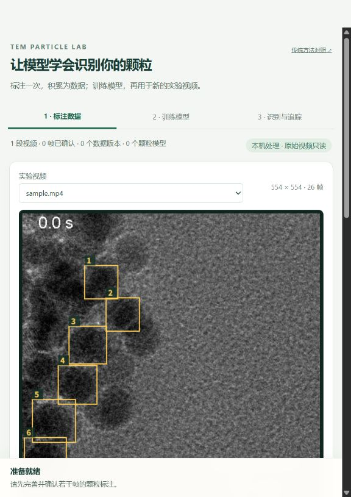

# TEM Particle Lab · 可标注、可训练的颗粒识别与追踪

本机完成 **人工标注 → 训练检测模型 → 导入新视频 → 模型识别颗粒 → 选择目标 → 追踪与复核**。标注、数据版本、权重和每次运行结果都会保存，可以积累并重新训练。

方法为**监督学习 + detection/association**。默认检测器为 PyTorch / Ultralytics YOLO26n，关联器为 ByteTrack；提供 Trackpy 及历史 Kalman + Hungarian 对照。人工纠错用于下一轮监督训练，不是强化学习。

**当前：软件与 GPU 训练流程已验证；尚无用户确认的完整 TEM 训练标签，因此还没有可供实验使用的 TEM 模型。** 合成检查权重与真实项目隔离，不出现在模型列表。旧的六个选点仅转成首帧建议框，仍是草稿。



## 测试人员快速上手

本仓库是 private 测试版。测试人员需要 Windows 10/11、Python 3.12 和至少约 10 GB 可用磁盘空间；有 NVIDIA GPU 时训练更快，没有 GPU 也可使用 CPU。仓库内包含一段 26 帧样例视频，可直接检查标注界面和传统方法；正式机器学习识别需要先确认标注并训练模型。

private 仓库只有受邀账号可以访问。仓库所有者可在 GitHub 的 **Settings → Collaborators → Add people** 输入测试人员的 GitHub 用户名；建议先给予普通协作者权限，不共享 GitHub 密码或访问令牌。

1. 在 GitHub 仓库页面点击 **Code → Download ZIP**，解压到不含同步盘限制的本地目录；也可以使用 `git clone`。
2. 双击 `setup_ml.cmd` 安装环境。没有 NVIDIA GPU 时，在项目目录运行 `setup_ml.cmd cpu`。
3. 双击 `start_tracker.cmd`，浏览器会打开本机页面。页面只监听 `127.0.0.1`，不会把视频上传到外部服务。
4. 在“标注数据”查看样例、修改建议框并保存草稿。测试阶段不要把不完整的一帧点击为“已完整标注”。
5. 要测试训练：至少确认训练段和验证段各一帧含颗粒的完整标注，然后在“训练模型”选择“单视频试训”、创建数据版本并训练。
6. 训练完成后到“识别与追踪”，先识别当前帧，点击候选框选择目标，再运行追踪并检查导出的视频、CSV 和待复核清单。

首次反馈请使用仓库的 **Issues → New issue → 测试反馈** 模板，并附上：操作系统、是否使用 GPU、失败发生在哪一步、完整错误文字和 `results/server.log`。如问题发生在训练任务，可再附对应 `results/learning/jobs/<任务编号>/job.log`。上传日志前请检查其中是否包含本机用户名、视频路径或实验信息；不要上传未经授权的 TEM 原始数据、正式模型权重或标注数据。

推荐测试顺序：安装与启动 → 样例帧浏览 → 草稿保存/重开 → 数据版本创建 → 小轮数试训 → 模型识别 → 目标选择 → 视频和 CSV 导出。每一步的预期行为与已知限制见下文。

## 启动与环境

当前电脑：双击 `start_tracker.cmd`。环境已装在 `.venv-ml`，自动选择可用 GPU，否则使用 CPU。入口从本地端口 8765 开始查找，旧版占用时新版可能使用 8766。

测试人员从 GitHub 克隆后不会获得开发者本机的 `.venv-ml`，需要先执行一次 `setup_ml.cmd`。虚拟环境、训练数据、模型权重和个人运行结果默认被 `.gitignore` 排除，避免误提交科研数据。

另一台 Windows 电脑：安装 Python 3.12（包含 Python Launcher），解压完整项目，运行 `setup_ml.cmd`，再运行 `start_tracker.cmd`。默认安装 CUDA 13.0 对应的 PyTorch；无 NVIDIA GPU 可运行 `setup_ml.cmd cpu`。首次安装和获取官方初始权重需要网络；视频与标注在本机处理。

本次验证：Python 3.12.14、PyTorch 2.14.0+cu130、torchvision 0.29.0+cu130、Ultralytics 8.4.165、OpenCV 5.0.0.93，RTX 4060 Laptop 8 GB。主要依赖见 `requirements-ml.txt`，完整版本见 `requirements-ml-lock.txt`。CPU 安装使用前者与官方 CPU wheel 索引，不直接套用含 CUDA 后缀的锁文件。

## 1. 标注数据

在“标注数据”页面拖动鼠标画框。已有框可移动、拖动角点调整大小，支持撤销、删除、复制上一帧、保存草稿。框贴近可辨认颗粒的外缘，标准保持一致。

- **训练标签须覆盖该整帧所有可辨认颗粒**，包括最终不想追踪的目标。只标出想追踪的几个，会把其他可见颗粒错误地当成背景。
- 检查误框、漏框和位置后，点击“整帧已完整标注，确认保存”。空帧须明确勾选负样本；完整性难以判断的帧保留草稿。
- 旧 ROI、复制框、模型建议均不自动进入训练。已确认标注发生修改后，需重新确认。
- 身份 ID 可留空，检测训练不需要跨帧身份。框列表顺序不是旧截图的目标 ID。

“推荐下一批标注帧”覆盖不同时间与画面；已有模型后还结合检测分数的不确定性。建议帧与建议框均需人工检查。

当前样例只有 26 帧。可先检查 0、4、8、12、16、21、23、25 帧建立流程试训；这只是起步安排，不代表足以达到某个准确率。验证迁移能力还需其他独立实验的视频与标注。

## 2. 数据版本与训练

导入视频时填写独立实验组。同一实验的不同片段使用同一组名，不能把相邻片段当作独立实验。默认按实验隔离训练与验证，也能明确指定训练、验证、独立测试用途。

只有一个视频时选择“单视频试训”。默认 25% 验证比例、隔离间隔 2：对当前 26 帧视频，已确认的 0–16 帧可训练，21–25 帧可验证，17–20 帧排除。该模式不能证明新实验泛化能力。

点击“创建数据版本”，选数据版本与训练起点，再点击“开始训练并验证”。默认 YOLO26n、60 轮、640 输入、batch 4，均为待验证的起始设置。训练期间可继续标注，新标注进入下一次数据版本。显存不足先减小 batch，或在 `config/learning.yaml` 设置 `training.device: cpu`。

训练保存 `best.pt`、数据/配置/硬件记录、日志，以及 precision、recall、mAP50、mAP50–95。验证集参与模型选择，不是未接触的独立测试集。以后可选已有颗粒模型为起点，用包含旧数据和新标注的数据版本继续微调。父模型的已见数据也参与划分检查，防止验证泄漏。

## 3. 模型识别后选择目标

在“识别与追踪”选择训练完成的模型，点击“识别当前帧”，再点击橙色候选框。选中的目标显示绿色圆圈，可以只选一颗或若干颗，支持从中间帧开始，或为同一 ID 添加后续校正锚点。

低分候选供 ByteTrack 恢复；新目标需达到起始门限。降低起始门限需检查误检，检测分不是正确概率。默认不把分数再次融合进几何匹配；仍需用本域验证比较此设置。

点击“追踪所选颗粒并导出”。绿色圆圈跟随目标，黄色线连接连续观测中心。缺测坐标留空，线不跨缺测或人工重设点。后端身份失联后不会自动换到附近的新身份；可以校正后重跑。识别框可转成草稿，人工检查后用于下一轮训练。

## 标定与测量含义

采集帧率和 nm/pixel 暂未提供，保持空值，已记入 `EXPERIMENT_NOTES.md`。容器 1 fps 与画面时间标注不同，不自动视为采集帧率。无标定时只提供像素与视频播放时间。

坐标为**原图检测框中心**；Kalman 预测仅用于关联。框面积和圆形显示 ROI 面积都不是颗粒分割面积。本版不声称亚像素物理精度，不推断合并/分裂、扩散系数或原子结构事件。

背景 phase correlation / ECC 配准保留质量标志与原始坐标。配准失败后的累计背景相对坐标留空，默认不把可疑漂移用于关联。

## 命令复现

在项目目录的 PowerShell 运行，替换界面中的 `DATASET_ID`、`MODEL_ID`、`VIDEO_ID`。

```powershell
.\.venv-ml\Scripts\python.exe -X utf8 scripts\particle_lab.py status
.\.venv-ml\Scripts\python.exe -X utf8 scripts\particle_lab.py dataset --split-mode temporal --gap 2
.\.venv-ml\Scripts\python.exe -X utf8 scripts\particle_lab.py train --dataset DATASET_ID --epochs 60
.\.venv-ml\Scripts\python.exe -X utf8 scripts\particle_lab.py train --dataset DATASET_ID --initial-model MODEL_ID
.\.venv-ml\Scripts\python.exe -X utf8 scripts\particle_lab.py track --input data\raw\sample.mp4 --model MODEL_ID --seeds data\learning\selections\VIDEO_ID.json --output results\my_run
.\.venv-ml\Scripts\python.exe -X utf8 scripts\particle_lab.py evaluate --model MODEL_ID --dataset DATASET_ID --split test
.\.venv-ml\Scripts\python.exe -X utf8 scripts\compare_learned.py --run results\my_run --output results\my_comparison
.\.venv-ml\Scripts\python.exe -X utf8 scripts\evaluate_tracking.py --tracks results\my_run\tracks.csv --reference my_identity_reference.csv --output results\my_run\reference_metrics.json
.\.venv-ml\Scripts\python.exe -X utf8 -m pytest -q
```

独立测试要求数据版本已有测试实验。`compare_learned.py` 在**相同学习检测输出**上比较 ByteTrack、Trackpy、6D Kalman + Hungarian，可加 `--reference` 提供人工身份参考。简单参考的列为 `frame,track_id,center_x,center_y,visible`，只评价所标注身份点。HOTA/IDF1/MOTA 需完整身份 GT 与对应评估协议，目前不伪造这些指标。

## 持久文件与输出

| 目录 | 内容 |
| --- | --- |
| `data/learning/` | 视频副本、逐帧标注、修改历史、目标选择 |
| `data/datasets/<版本>/` | 固定 PNG/YOLO 标签、分组、哈希、标注来源 |
| `models/pretrained/` | 官方通用初始化权重，不是 TEM 成品 |
| `models/registry/<版本>/` | 颗粒模型权重、来源卡、父模型记录 |
| `results/learning/train_*/` | 配置、日志、实际硬件、验证结果 |
| `results/learning/tracking_*/` | 视频、坐标、待复核清单、统计、轨迹图 |

每次追踪输出 `annotated.mp4`、`tracks.csv`、`review_required.csv`、`track_statistics.csv`、`trajectories.png`、`detections.json`、`all_linked_candidates.csv`、`drift.csv`、`metrics.json`、配置、模型卡、源码哈希。CSV 包含原图坐标、框尺寸、身份、分数、观测/缺测状态、时间基准和可用标定。原始视频不改动。

当前为有内存保护的离线处理，默认解码上限 1 GB；界面单次导入上限 512 MB。越界报错，不截取部分视频冒充完整运行。关闭网页不会停止训练，重新打开可读进度；停止任务保留已存标注与旧模型。

## 验证与历史工作

- [本次架构与候选复评](docs/learning_architecture.md)
- [软件、GPU 训练与界面验证](docs/learning_validation.md)
- [第一版研究报告](docs/research_report.md)、[完整候选表](docs/method_comparison.csv)、[第一版实验](docs/experiment_results.md)
- [第一版使用说明](docs/legacy_README.md)：模板方法、光流等保留在“传统方法对照”入口。

判定新方法更好，需要在独立实验、相同目标与人工身份参考上比较漏检、误检、定位误差和换 ID。观测率、轨迹平滑程度、通用数据集 mAP 均不能替代 TEM 准确性证据。
