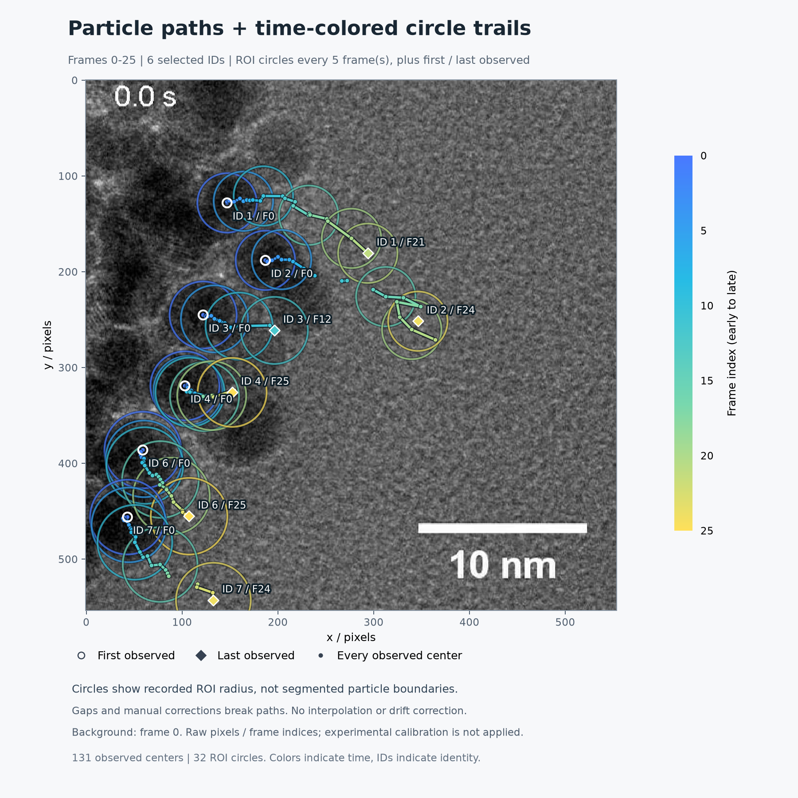

# TEM Particle Lab · TEM 颗粒识别与追踪

给视频里的颗粒画圈，追踪它们的移动，并把不同时间的圆圈叠加到一张图里。

**第一次使用：按下面 4 步操作，先用自带样例生成一张图片。不需要写代码。**

准备一台常见的 **64 位 Windows 10 / 11 电脑**，保持联网，至少留出约 **10 GB** 空间。

> 如果这台电脑以前已经成功打开过工具，直接双击 `start_tracker.cmd`，跳到第 4 步。

## 第 1 步：下载工具

1. 登录你的 GitHub 账号，打开[项目页面](https://github.com/virchant085/tem-particle-lab)。
2. 点击绿色的 **Code** 按钮，再点 **Download ZIP**。
3. 下载完成后，找到 ZIP 文件，右键点击它，选择 **全部解压**，再点 **解压**。
4. 打开解压后的文件夹，直到能看到 **`setup_ml.cmd`** 和 **`start_tracker.cmd`**。

请在解压后的普通文件夹里操作。电脑可能隐藏文件后缀，此时只显示 `setup_ml` 和 `start_tracker`。

**打不开项目页面，显示 404？** 这是私人项目。把你的 GitHub 用户名告诉提供工具的人，让他邀请你；接受邀请后再打开。

## 第 2 步：安装，只做一次

先安装运行工具需要的 Python。如果已经装好了 **Python 3.12 和 Python Launcher（启动器）**，可跳过这一小段。

1. 点击[下载 Python 3.12 的 Windows 安装程序](https://www.python.org/ftp/python/3.12.10/python-3.12.10-amd64.exe)。
2. 双击下载的文件，勾选 **Add python.exe to PATH**，其他选项保持默认，包括 Python 启动器。
3. 点击 **Install Now**，安装成功后点 **Close**。

下载链接来自 [Python 官方页面](https://www.python.org/downloads/release/python-31210/)，提供带图形安装器的 3.12.10 版本。

然后回到第 1 步解压的工具文件夹：

1. 双击 **`setup_ml.cmd`**。
2. 会出现一个黑色窗口，自动下载所需文件。第一次可能比较久，请保持联网，等待完成。
3. 看到 **`Installation complete. Open start_tracker.cmd to start.`**，就表示安装成功。按键盘任意一个键关闭窗口。

不清楚显卡型号，也可以先按默认步骤安装。没有可用显卡时，程序会使用电脑的处理器运行，训练会慢一些。

## 第 3 步：打开工具

双击 **`start_tracker.cmd`**，稍等，浏览器会自动打开。

看到“**让模型学会识别你的颗粒**”这个标题，就打开成功了。页面运行在你自己的电脑上。

**以后每次使用，只需双击 `start_tracker.cmd`，不用重复安装。**

## 第 4 步：生成第一张圆圈残影图

这一步使用自带示例，**不用先训练，也不用点“识别当前帧”**。

1. 页面顶部的“实验视频”选择 **`sample.mp4`**。
2. 点击 **3 · 识别与追踪**，向下滚动，找到 **时间轨迹与圆圈残影**。
3. “追踪结果来源”选择 **样例 · 传统模板追踪（身份未经真值核验）**。
4. 其他设置先不改，直接点 **生成时间痕迹图**。
5. 图片出现后，点击 **下载 PNG**。图片通常会保存在电脑的“下载”文件夹里。

看到这样的图片，就完成第一次试用了：

想调整图片，改完设置后再点一次“生成时间痕迹图”：

| 想做什么 | 怎么操作 |
| --- | --- |
| 只看一颗或几颗 | 取消勾选不想显示的颗粒 |
| 只看某一段时间 | 修改“起始帧”和“结束帧”；帧就是视频中的一张画面 |
| 圆圈太密 | 把“圆圈间隔”从 5 改成 10；数字越大，圆圈越少 |

蓝色表示较早，黄色表示较晚。圆圈是定位范围，不是颗粒真实外形。样例只演示显示方式，不代表你的新视频已经识别正确。

## 想处理自己的视频

**当前下载包没有已经训练好的 TEM 颗粒模型。** 第一次需要你给颗粒画框，教会模型后，再让它识别和追踪。

<b>点击展开：处理自己视频的 5 个步骤</b>

### 1. 放入视频

点击 **添加实验视频**，填写“独立实验组名称”（例如“实验A”），选择视频文件，点 **导入视频**。先用一段较短的 MP4，单个文件不超过 512 MB。同一次实验的片段使用同一个组名。

### 2. 给颗粒画框

进入 **1 · 标注数据**，拖动图片下方的滑块查看不同画面。

按住鼠标左键，拖出一个框，把颗粒包住。已有框可以移动、调整大小或删除。**每张用于训练的画面，都要框出其中所有能辨认的颗粒，包括以后不打算追踪的颗粒。**

检查完一整张画面，点 **整帧已完整标注，确认保存**；没检查完就点 **保存草稿**。身份 ID 可以留空。

从视频前、中、后段各挑几张画面重复操作，不要只标第一张。若用自带样例练习，可选第 **0、4、8、12、16、21、23、25** 帧。这只是起步练习，效果要在训练后检查。

### 3. 让模型学习

第一次先用一段视频练习：

1. 进入 **2 · 训练模型**。
2. “验证方式”选 **单视频试训：时间分块并隔离相邻帧**。
3. 点 **创建数据版本**，等待完成。
4. 在“数据版本”中选刚创建的那一项，其他设置保持默认。
5. 点 **开始训练并验证**，等页面提示“模型已训练”。

提示数据不足时，回去补充视频前段和后段的完整标注。只保存草稿还不能用于训练。单视频试训能帮助跑通流程，但不能保证对新实验同样有效。

### 4. 选择要追踪的颗粒

1. 进入 **3 · 识别与追踪**，选择刚训练完成的模型。
2. 点 **识别当前帧**，等橙色框出现。
3. 点击想追踪的颗粒框，选中后会出现绿色圆圈。
4. 点 **追踪所选颗粒并导出**。

不知道“采集帧率”和“像素尺寸”时，留空即可。

### 5. 保存结果

完成后点 **追踪视频** 或 **坐标 CSV**。视频打开后，可右键选择“视频另存为”；CSV 是可以用 Excel 打开的坐标表。

要生成圆圈残影图，向下找到 **时间轨迹与圆圈残影**，选择刚完成的追踪结果，再按首页第 4 步生成和下载。

以后导入新视频，可以选择同一个模型，直接从“识别当前帧”开始。检查有没有漏掉颗粒、圈错位置或跟错目标；效果不好时，需要补充标注再训练。

## 遇到问题怎么办

| 你看到的情况 | 下一步 |
| --- | --- |
| 没找到 `start_tracker.cmd` | 打开解压后的文件夹，再往里面找一层；确认不是仍在 ZIP 压缩包里 |
| 安装出现 `Setup failed` | 截下窗口中的错误文字，发给提供工具的人；这表示安装没有成功 |
| 提示需要 Python 3.12，或找不到 `py` | 回到第 2 步，确认安装了 Python 3.12，并保留了 Python 启动器 |
| “尚无训练完成的颗粒模型” | 初次使用是正常的；先按第 4 步体验样例，处理新视频再展开训练教程 |
| 圆圈互相挡住 | 少选几个颗粒，或把圆圈间隔调大，再生成 |
| 想停止训练 | 点页面下方“停止当前任务”；只关闭网页不会停止训练 |

其他问题：**把“在哪一步、点了哪个按钮、出现什么提示”连同截图发给提供工具的人。** 会使用 GitHub 的测试者也可以[填写测试反馈](https://github.com/virchant085/tem-particle-lab/issues/new?template=test-feedback.yml)。

## 保留数据与分享工具

你的标注、模型和结果保存在电脑里的工具文件夹中。**请保留整个文件夹，重新下载的 ZIP 不包含你自己新增的标注和模型。** 更新前先备份旧文件夹。

给别人试用时，发送[项目链接](https://github.com/virchant085/tem-particle-lab)。由仓库所有者在 **Settings → Collaborators → Add people** 邀请对方账号，对方接受后按本页操作。你浏览器中的 `127.0.0.1` 地址只用于你自己的电脑，不是分享给别人的使用地址。

---

算法、训练设置、标定、命令和文件格式见[详细使用与技术说明](docs/user_guide_advanced.md)。日常试用不需要先读那份文档。
